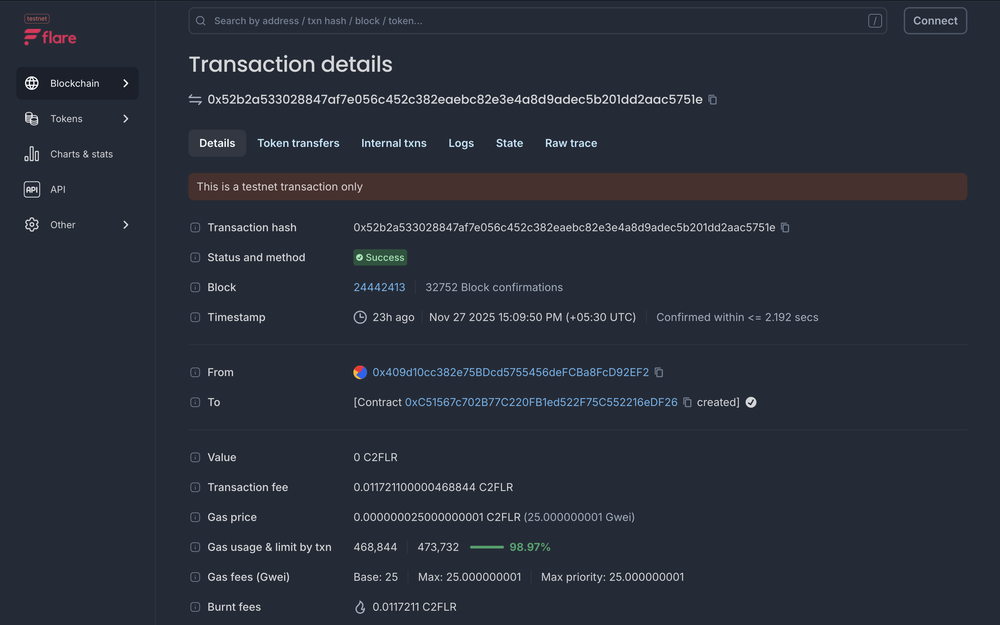

# NourishAI 🥗



**NourishAI** is a premium, intelligent meal planning application designed to revolutionize how you eat. By combining advanced AI with your personal preferences and pantry inventory, it creates perfectly tailored weekly meal plans that save you time, money, and stress.

## 🚀 Features

- **🤖 Dual-Engine AI**: Powered by **OpenAI (GPT-4)** for high-quality generation, with an automatic fallback to **Google Gemini** for 100% reliability.
- **🥑 Smart Pantry**: Input ingredients you already have, and the AI will prioritize them in your recipes to reduce food waste.
- **🍳 Recipe Details & Cooking Mode**: View detailed ingredients and instructions for every meal. Switch to "Cooking Mode" for a distraction-free kitchen experience.
- **🌗 Dark Mode**: A stunning, fully responsive UI with seamless light and dark theme switching.
- **📋 Smart Shopping List**: Automatically aggregates ingredients from your weekly plan into a checklist.
- **✨ Premium UX**: Built with Glassmorphism, smooth animations, and a modern aesthetic.

## 🛠️ Tech Stack

- **Framework**: Next.js 15 (App Router)
- **Styling**: Tailwind CSS v4
- **State Management**: Zustand
- **AI Integration**: OpenAI SDK + Google Generative AI SDK
- **Icons**: Lucide React
- **Theming**: next-themes

## 🏁 Getting Started

1.  **Clone the repository**:

    ```bash
    git clone https://github.com/AVPthegreat/Flare-Blockchain.git
    cd Flare-Blockchain
    ```

2.  **Install dependencies**:

    ```bash
    npm install --legacy-peer-deps
    ```

3.  **Set up Environment Variables**:
    Create a `.env.local` file in the root directory and add your API keys:

    ```env
    OPENAI_API_KEY=your_openai_key
    GEMINI_API_KEY=your_gemini_key
    ```

4.  **Run the development server**:

    ```bash
    npm run dev
    ```

5.  Open [http://localhost:3000](http://localhost:3000) with your browser to see the result.

## 📄 License

This project is open source and available under the [MIT License](LICENSE).
